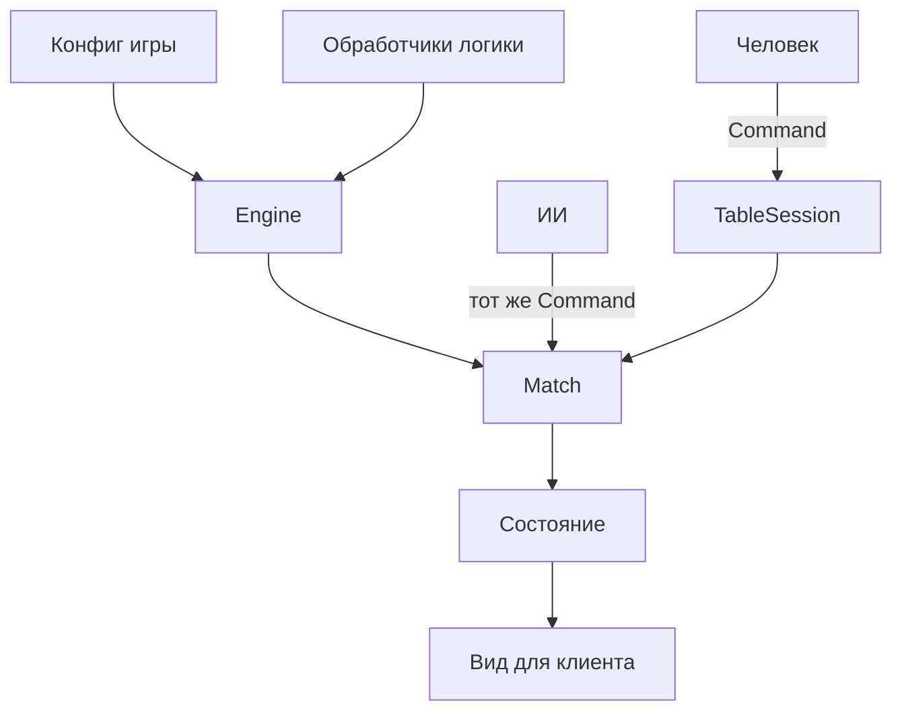

# Deckforge

Движок кооперативных колодостроительных игр. За образец взяты две партии одного семейства: «Гарри Поттер. Битва за Хогвартс» и «Рик и Морти. Анатомический парк».

Общий ход такой: в начале хода открываются события и враги бьют активного героя, затем герой разыгрывает руку, тратит атаку, лечение и валюту покупки, после хода сбрасывает карты и добирает руку. Победа — пройти все локации. Поражение — потерять последнюю локацию, остаться без колоды событий или оглушить всю команду.

Карты, колоды, герои, поле, кубики, жетоны и предметы задаются **конфигом игры**. Картинки — это пути в конфиге, клиент сам их рисует. Демо-карты написаны для движка и не повторяют коммерческие колоды: свои названия, короткие эффекты и заглушки вместо артов.

## Что уже есть

- Карты и их экземпляры, личные колоды (добор, сброс, рука, зона розыгрыша), общий ряд покупки.
- Игроки и герои: здоровье, оглушение, пулы ресурсов, способность.
- Поле: рынок, враги, локации по порядку, колода событий, изгнание.
- Вспомогательные предметы: кубик, жетоны, разовые предметы на столе.
- Команды (`Command`) — единственный способ менять партию. Один и тот же формат для человека, ИИ и сети.
- Место за столом может занимать человек или компьютер. После команды человека движок сам доигрывает автоматические фазы и ходы ИИ.
- `TableSession` сверяет токен соединения с `playerId` в команде.
- Клиенту отдаётся `view()`: порядок колод скрыт, чужая рука скрывается, если конфиг это включает. Полный снимок `serialize()` остаётся у ведущего.

## Запуск

```bash
npm install
npm test
npm run demo
```

## Как устроена партия



Фазы хода: `threat` (восстановление, пассивная способность, эффект локации, события, удары врагов) → `action` (розыгрыш, покупка, атака, лечение, кубик, жетоны, предметы) → `cleanup` (сброс, добор, следующий игрок).

Эффект, которому нужен выбор, ставит партию на паузу. Ответ — команда `choose`. ИИ выбирает сам.

## Две игры

| | Битва за Хогвартс | Анатомический парк |
| --- | --- | --- |
| Валюта | влияние | образцы |
| Враг после победы | не заменяется | на место выходит следующий |
| Пустая колода событий | поражение | перемешать сброс |
| Пустая колода врагов | ничего | перемешать сброс |
| Предметы | кубик факультета | жетон образца и портальная пушка |
| Своя логика | `patronus` — атака по числу союзников | `dissect` — сжечь верх рынка и получить атаку по цене |

Оба конфига кооперативные: компьютер за столом — напарник, а противник — само поле (враги, события, локации). Сторона места (`party` / `rival`) и режим `freeForAll` уже лежат в модели, чтобы позже добавить соревновательные правила, не ломая команды.

## Своя игра

Конфиг — обычный объект `GameConfig`: карты, герои, колоды, картинки, лимиты поля. Всё, что не выражается готовыми эффектами (`gain`, `draw`, `damageEnemy`, `choice`, …), вешается на `custom` и функцию в модуле.

```ts
const registry = new GameRegistry();
registry.register(defineModule(config, {
  patronus(ctx) {
    ctx.push([{ op: "gain", resource: "attack", amount: 1 }]);
  },
}));
const engine = new DeckEngine(registry);
```

`register` проверяет ссылки: id карт, цены, слоты врагов, картинки, наличие обработчиков.

Партия:

```ts
const match = createEngine().createMatch({
  gameId: "hogwarts",
  seed: 1,
  players: [
    { name: "Аня", controller: "human", heroId: "harry" },
    { name: "Компьютер", controller: "ai", heroId: "ron" },
  ],
});

const view = match.view("p1");
const command = view.legalActions[0]?.command;
if (command) match.submit(command);
```

Ведущий рассылает клиентам `view(playerId)` и список событий из `submit`. Переподключение — `serialize()` / `restoreMatch`. Клиенту полный снимок не отдают: в нём лежит порядок колод.
