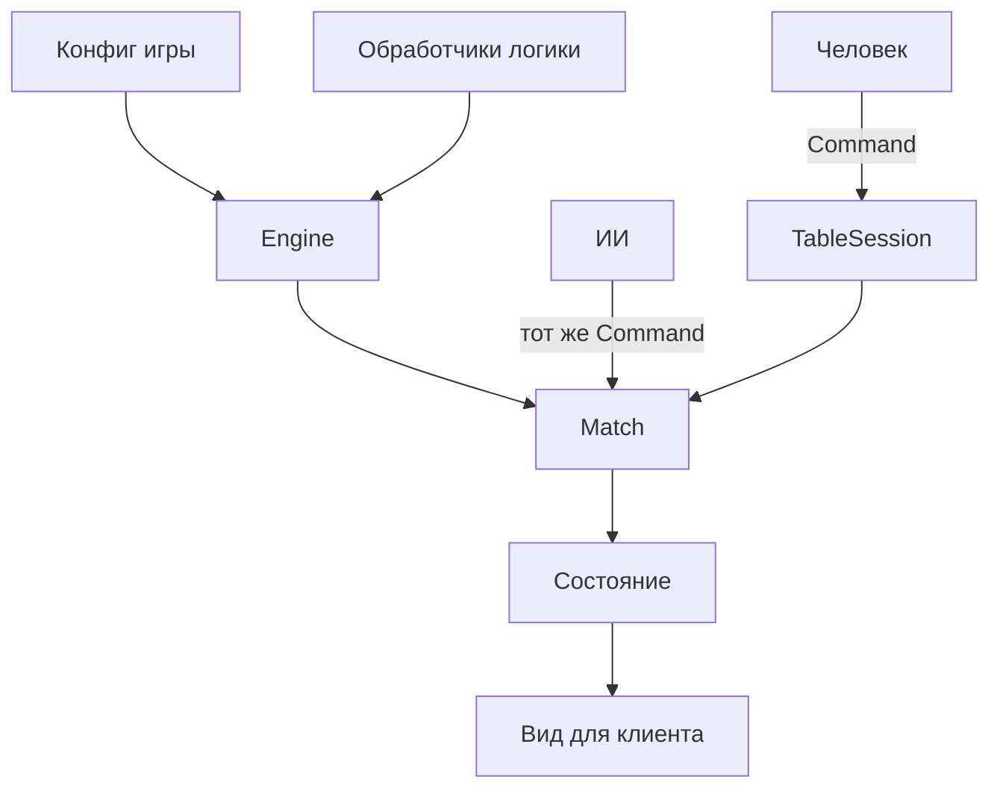

# Deckforge

Две разные игры на общих сущностях: карты, колоды, герои, случайность и место за столом. «Битва за Хогвартс» — кооперативный колодострой. «Анатомический парк» — соревновательная укладка тайлов: парк собирается из аттракционов, а не из локаций, которые нужно бить.

Демо-карты и тайлы написаны для движка и не повторяют коммерческие колоды: свои названия, короткие эффекты и заглушки вместо артов.

## Что уже есть

Колодострой:

- Карты и их экземпляры, личные колоды (добор, сброс, рука, зона розыгрыша), общий ряд покупки.
- Игроки и герои: здоровье, оглушение, пулы ресурсов, способность.
- Поле: рынок, враги, локации по порядку, колода событий, изгнание.
- Вспомогательные предметы: кубик, жетоны, разовые предметы на столе.
- Команды (`Command`) — единственный способ менять партию. Один и тот же формат для человека, ИИ и сети.
- Место за столом может занимать человек или компьютер. После команды человека движок сам доигрывает автоматические фазы и ходы ИИ.
- `TableSession` сверяет токен соединения с `playerId` в команде.
- Клиенту отдаётся `view()`: порядок колод скрыт, чужая рука скрывается, если конфиг это включает. Полный снимок `serialize()` остаётся у ведущего.

Парк:

- Сетка тайлов, рука, колода и сброс тайлов, фокус-карты, болезни и реакции тела.
- Команды парка (`ParkCommand`) отдельные от команд колодостроя. Человек и компьютер ходят одним форматом.
- Клиенту отдаётся вид без порядка колод. В горячем кресле чужая рука — только число карт.

## Как разложено

- `packages/engine` — колодострой в `src/core`, парк в `src/park`. Общие для обеих игр: генератор случайности, ошибка подготовки и тип игрока (человек или компьютер).
- `packages/table` — стол колодостроя.
- `apps/hogwarts` — кооперативный колодострой: свой конфиг, картинки и тема.
- `apps/anatomy-park` — свой стол парка, каталог тайлов и картинки. Общий стол колодостроя ему не нужен.

В исходниках движка модули импортируются без расширения. tsup собирает публичный пакет в `packages/engine/dist`. Приложения и тесты читают TypeScript напрямую.

## Запуск

```bash
npm install
npm test
npm run demo
npm run dev:hogwarts
npm run dev:anatomy-park
```

`dev:hogwarts` открывает стол на http://127.0.0.1:5173, `dev:anatomy-park` — на http://127.0.0.1:5174. В Хогвартсе по умолчанию за столом один человек: враги и события ведёт движок. Кнопкой «Добавить игрока» можно посадить второго героя, в том числе компьютер. В парке тоже можно играть одному или добавить соперников.

Собранные столы публикуются на GitHub Pages: https://vladimirleskin.github.io/cards/. У каждого открытого пул-реквеста свой стенд: https://vladimirleskin.github.io/cards/pr/2/ для пул-реквеста номер 2. Список стендов — https://vladimirleskin.github.io/cards/pr/. После закрытия пул-реквеста каталог удаляется. Локально ту же сборку даёт `npm run build:pages` — результат лежит в `site/`.

## Как устроена партия Хогвартса



Фазы хода: `threat` (восстановление, пассивная способность, эффект локации, события, удары врагов) → `action` (розыгрыш, покупка, атака, лечение, кубик, жетоны, предметы) → `cleanup` (сброс, добор, следующий игрок).

Эффект, которому нужен выбор, ставит партию на паузу. Ответ — команда `choose`. ИИ выбирает сам.

Перед рукой, если в начале хода что-то произошло, человек видит сводку угрозы и подтверждает её.

## Как устроен парк

Ход такой: если на клетке героя стоит болезнь, он сбрасывает тайл. Затем переход — пойти по тайлам, сдвинуть все болезни на шаг или переставить соседний тайл. Потом одно действие: положить тайл в пустую клетку рядом с собой, взять два тайла, выстрелить по болезни или выйти, стоя на люке. Лишние тайлы сверх лимита руки сбрасываются, и ход переходит дальше.

Очки даёт сам тайл и добавка за подходящих соседей. Фокус тратится вместе с укладкой и на поле не ложится. Шаг на транзит бесплатный. Выход с люка даёт очки и выводит из партии. Парк закрывается от второго сердечного приступа, от второй пустой колоды тайлов, когда вышли все или когда кончились 24 круга. Побеждает тот, у кого больше очков.

## Две игры

| | Битва за Хогвартс | Анатомический парк |
| --- | --- | --- |
| Стол | общий колодострой | свой, в приложении парка |
| Цель | вместе пройти локации | набрать больше очков, чем соперники |
| Поле | рынок, враги, локация | сетка тайлов |
| Колоды | карты героя, рынок, события, враги | тайлы, болезни, реакции тела |
| Ход | угроза, действие, сброс | переход и одно действие |

В Хогвартсе компьютер за столом — напарник, а противник — само поле. В парке игроки соперничают. Сторона места (`party` / `rival`) в колодострое остаётся, чтобы позже добавить соревновательные правила, не ломая его команды.

## Своя игра

Колодострой задаётся объектом `GameConfig`: карты, герои, колоды, картинки, лимиты поля. Всё, что не выражается готовыми эффектами (`gain`, `draw`, `damageEnemy`, `choice`, …), вешается на `custom` и функцию в модуле.

```ts
const registry = new GameRegistry();
registry.register(defineModule(config, {
  patronus(ctx) {
    ctx.push([{ op: "gain", resource: "attack", amount: 1 }]);
  },
}));
const engine = new DeckEngine(registry);
```

`register` проверяет ссылки: id карт, цены, слоты врагов, картинки, наличие обработчиков.

Партия:

```ts
const match = createEngine([hogwartsModule]).createMatch({
  gameId: "hogwarts",
  seed: 1,
  players: [
    { name: "Аня", controller: "human", heroId: "harry" },
    { name: "Компьютер", controller: "ai", heroId: "ron" },
  ],
});

const view = match.view("p1");
const command = view.legalActions[0]?.command;
if (command) match.submit(command);
```

Ведущий рассылает клиентам `view(playerId)` и список событий из `submit`. Переподключение — `serialize()` / `restoreMatch`. Клиенту полный снимок не отдают: в нём лежит порядок колод.

Парк задаётся отдельно, объектом `ParkConfig`: тайлы, болезни, реакции тела и герои. Это не `GameConfig`.

```ts
const match = ParkMatch.create(anatomyPark, {
  seed: 1,
  players: [
    { name: "Рик", controller: "human", characterId: "rick" },
    { name: "Морти", controller: "ai", characterId: "morty" },
  ],
});

const view = match.view();
const command = view.legalActions[0]?.command;
if (command) match.submit(command);
```
